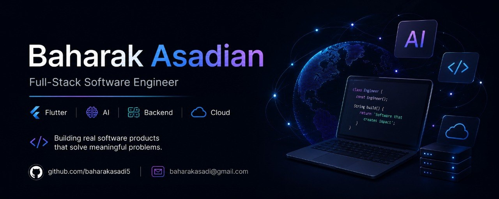

👋 Hi, I'm Baharak Asadi

Software Engineer | Flutter • Backend • AI

I build production-oriented software applications with a focus on clean architecture, scalable systems, mobile development, backend engineering, and AI-powered solutions.

---

🚀 What I Build

- 📱 Cross-platform mobile applications with Flutter
- ⚙️ Backend services and REST APIs
- 🏗️ Clean and maintainable software architectures
- 🗄️ Local and relational data storage solutions
- 🤖 AI-powered application features
- 🧪 Testable and reliable software
- 🔄 CI/CD workflows and automated development processes

---

🛠️ Technical Focus

Mobile

- Flutter
- Dart
- Riverpod
- Material 3
- Hive

Backend

- ASP.NET Core
- Python
- REST APIs
- PostgreSQL

Engineering

- Clean Architecture
- Repository Pattern
- State Management
- Offline-first Architecture
- Testing
- Git & GitHub
- CI/CD

---

## 🛠️ Tech Stack
### Skills

⭐️ Featured Projects
---

## 🚀 Featured Project
### 📱 InvenShare

A full-stack platform connecting inventors and investors.

Built with:
- Flutter
- Dart
- Supabase
- AI Integration
- Backend Services
- Clean Architecture

Features:
- Authentication
- Invention Management
- AI Analysis
- Investor Discovery
- Cross-platform Support

🔗 Repository:
https://github.com/baharakasadi5/invenshare

### 📱 InvenShare

A full-stack platform connecting inventors and investors.

Built with:

- Flutter
- Dart
- Supabase
- AI Integration
- Backend Services
- Clean Architecture

Features:

- User authentication
- Invention management
- AI-powered analysis
- Investor discovery
- Cross-platform development

🔗 Repository:
https://github.com/baharakasadi5/invenshare

---

🌐 Full-Stack Applications

Backend and full-stack projects exploring scalable APIs, authentication, database architecture, and production-oriented application design.

Focus: ASP.NET Core • PostgreSQL • REST API • Authentication • Clean Architecture

---

🤖 AI & Intelligent Applications

Projects exploring practical AI integration into real-world applications, including multilingual communication and intelligent application features.

Focus: AI • Flutter • APIs • Speech & Language Technologies

---

🧠 Engineering Philosophy

I focus on building software that is:

- Maintainable
- Testable
- Scalable
- Secure
- User-focused
- Well documented

I believe good software engineering is not only about writing code, but also about making thoughtful architectural decisions and continuously improving the product.

---

📚 Currently Building

- Advanced Flutter applications
- Full-stack systems
- Backend APIs
- AI-powered applications
- Developer tools
- Automated testing and CI/CD workflows

---

📫 Connect

🔗 LinkedIn:
https://www.linkedin.com/in/baharak-asadian-44192842b/

🔗 GitHub:
https://github.com/baharakasadi5
---

⭐️ Thanks for visiting my profile.

---

